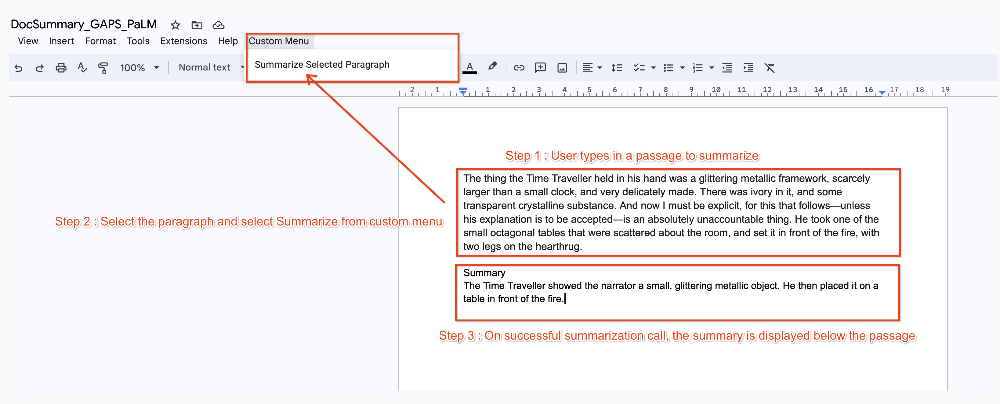

## Text Summarization in Google Docs using Vertex AI PaLM API

This application demonstrates how you can integrate Text Summarization inside a Google Doc. It uses a Cloud Function that we have deployed [Text Predict Cloud Function](../https://github.com/rominirani/genai-apptemplates-googlecloud/tree/main/text-predict-cloudfunction).

## How it works

The summarization inside the Google Doc is demonstrated in the screenshot below:



## Pre-requisites

The summarization in Google Doc is dependent on successful deployment of [Text Predict Cloud Function](../https://github.com/rominirani/genai-apptemplates-googlecloud/tree/main/text-predict-cloudfunction). Ensure that you have followed the instructions to deploy the `predictText` Cloud Function. 

The Cloud Function on successful deployment will be available at the following URL:

```bash
https://$GCP_REGION-$GCP_PROJECT.cloudfunctions.net/predictText
```

The function works as follows:
- Accepts a JSON data request as a POST method to the above url in the following format:
  ```
  {"prompt":"YOUR_PROMPT"}
  ```
- Returns back a JSON response in the following format :
  ```
  {"response_text":"YOUR_PROMPT_RESPONSE"}
  ```

## Steps to integrate summarization in your Google Doc

1. Make a copy of the [Gen AI Text Summarization - Google Doc Integration](https://docs.google.com/document/d/1kqAK6EXQZ0oacdhISd9sU8hxHflxkYAEXkk2XUSK9mo/copy) document.
2. From the main menu, click on `Extensions --> Apps Script`. This will open up the Apps Script editor and you can take a look at the code.
3. The code works as follows:
   - The selected text that the user wants to summarize is first identified.
   - This text is then sent via a Prompt to summarize it to the `predictText` Cloud Function.
   - The result is then displayed in the form of a Summary paragraph.
4. Type in the text that you would like to summarize. A sample paragraph is provided but you can have any other text too.
5. Select the text to summarize.
6. From the main menu, click on `Custom Menu --> Summarize Selected Paragraph`.
7. This will invoke the `predictText` Cloud Function, retrieve the result and add the Summary paragraph in the document.

