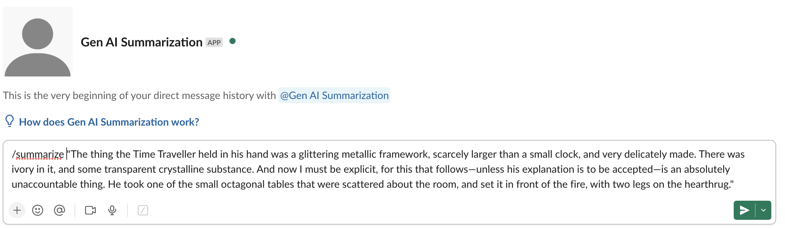
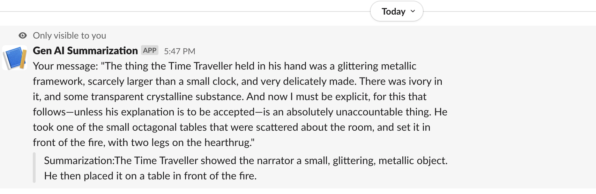

# Slack Integration

This application demonstrates how to create a [Slack Slash Command](https://api.slack.com/interactivity/slash-commands) integration that provides a summarization service to the user in the Slack Application. 

The user will invoke a slash command `/summarize` and provide the text to the be summarized. This will then invoke a Cloud Function that accepts the text and invokes the PaLM API for summarization. The result is then returned back to the Slack Slash command and displayed as a response to the user in the Slack Application. 

> NOTE: **Before you move forward, ensure that you have followed the instructions in [SETUP.md](../SETUP.md).**
Additionally, ensure that you have cloned this repository and are currently in the ```summarization-slack``` folder for the rest of the commands.

## Environment variables required

Your Cloud Function requires access to two environment variables:

- `GCP_PROJECT` : This the Google Cloud Project Id.
- `GCP_REGION` : This is the region in which you are deploying your Cloud Function. For e.g. us-central1.

These variables are needed since the Vertex AI initialization needs the Google Cloud Project Id and the region. The specific code line from the `main.py` function is shown here:
`vertexai.init(project=PROJECT_ID, location=LOCATION)`

In Cloud Shell, execute the following commands:
```bash
export GCP_PROJECT='<Your GCP Project Id>'  # Change this
export GCP_REGION='us-central1'             # If you change this, make sure region is supported by Model Garden. When in doubt, keep this.
```

These variables can be set via the following [instructions](https://cloud.google.com/functions/docs/configuring/env-var) via any of the following ways:

1. At the time of [deploying](https://cloud.google.com/functions/docs/configuring/env-var#setting_runtime_environment_variables) the Google Cloud Function. We will be using this method in the next section when we deploy the Cloud Function.
2. [Updating](https://cloud.google.com/functions/docs/configuring/env-var#updating_runtime_environment_variables) the environment variables after deploying the Google Cloud Function.

## Deploying the Summarize Cloud Function

Assuming that you have a copy of this project on your local machine with `gcloud` SDK setup on the machine, follow these steps:

1. Go to the root folder of this project.
2. You should have both the `main.py` and `requirements.txt` file present in this folder.
3. Provide the following command:

   ```bash
   gcloud functions deploy summarizeText \
   --gen2 \
   --runtime=python311 \
   --region=$GCP_REGION \
   --source=. \
   --entry-point=summarizeText \
   --trigger-http \
   --set-env-vars=GCP_PROJECT=$GCP_PROJECT,GCP_REGION=$GCP_REGION \
   --allow-unauthenticated
   ```

One successful deployment, you will receive the URL of the Cloud Function that has been deployed. The URL will be of the following format: `https://$GCP_REGION-$GCP_PROJECT.cloudfunctions.net/predictText`. Please note this down since we will need it in the next section.

## Creat the Slack Slash Command

We are going to create a custom Slash Command in Slack. This custom command that we shall call `/summarize` will invoke the Cloud Function that we have deployed in the previous section. Follow the steps given below:

1. Go to [api.slack.com/apps](https://api.slack.com/apps)
2. Click **Create New App** 
3. Choose **From scratch** option in **Create an app** window.
4. Give your app a name (for e.g. Summarization Service) and select the Slack Workspace that you want to develop your app in. Click on **Create App**. 
5. This will lead you to the **Settings** page. Click on Basic Information --> Slash Commands. Click on **Create New Command**
6. In the **Create New Command** form, provide the following values:
   - Command : Give a slash command. For e.g. /summarize
   - Request URL : Provide the full URL of the Cloud Function that we deployed. It will be of the following format: `https://$GCP_REGION-$GCP_PROJECT.cloudfunctions.net/summarizeText`
   - Give a Short Description and Usage Hint. 
7. Go back to **Settings --> Basic Information**. Click on **Install your app** and then click **Install to Workspace**. Go ahead and allow the next screen to install the app into your workspace. 

This completes the creation of the custom Slack App that is now installed in your Slack Workspace and has a custom Slash command (`/summarize`) that helps a user summarize a text that they provide in the message. 

## Invoking the Slash Command

Go to the Slack Workspace where you have installed the Summarization Slack Application.

Provide the slash command. A sample invocation is shown below:



Click on the **Send** button, this should invoke our summarization Cloud Function and return back the summarization response as shown below:


