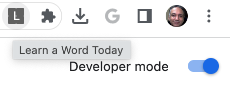
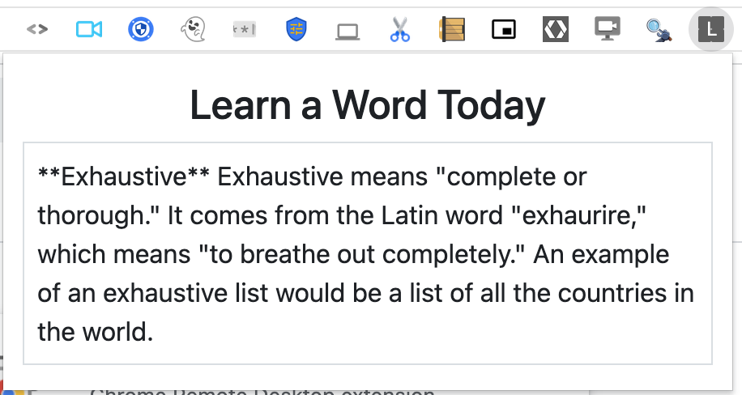

# Chrome Extension - Word of the Day

This application demonstrates how to create a Chrome Extension that provides a simple Word of the Day example. 

The Chrome Extension will invoke a Cloud Function that invokes the PaLM API with a prompt that says 

```
Provide a random word in English with its explanation and example usage.
```

The result is then returned back to Chrome Extension that then displays the same.

Before we get to the Chrome Extension, let us first deploy the Cloud Function that works with the PaLM API. 

## Environment variables required

Your Cloud Function requires access to two environment variables:

- `GCP_PROJECT` : This the Google Cloud Project Id.
- `GCP_REGION` : This is the region in which you are deploying your Cloud Function. For e.g. us-central1.

These variables are needed since the Vertex AI initialization needs the Google Cloud Project Id and the region. The specific code line from the `main.py` function is shown here:
`vertexai.init(project=PROJECT_ID, location=LOCATION)`

In Cloud Shell, execute the following commands:
```bash
export GCP_PROJECT='<Your GCP Project Id>'  # Change this
export GCP_REGION='us-central1'             # If you change this, make sure region is supported by Model Garden. When in doubt, keep this.
```

These variables can be set via the following [instructions](https://cloud.google.com/functions/docs/configuring/env-var) via any of the following ways:

1. At the time of [deploying](https://cloud.google.com/functions/docs/configuring/env-var#setting_runtime_environment_variables) the Google Cloud Function. We will be using this method in the next section when we deploy the Cloud Function.
2. [Updating](https://cloud.google.com/functions/docs/configuring/env-var#updating_runtime_environment_variables) the environment variables after deploying the Google Cloud Function.

## Deploying the Cloud Function

Assuming that you have a copy of this project on your local machine with `gcloud` SDK setup on the machine, follow these steps:

1. Go to the root folder of this project.
2. You should have both the `main.py` and `requirements.txt` file present in this folder.
3. Provide the following command:

   ```bash
   gcloud functions deploy wotd \
   --gen2 \
   --runtime=python311 \
   --region=$GCP_REGION \
   --source=. \
   --entry-point=wotd \
   --trigger-http \
   --set-env-vars=GCP_PROJECT=$GCP_PROJECT,GCP_REGION=$GCP_REGION \
   --allow-unauthenticated
   ```

## Test the Word of the Day Cloud Function

Since this Cloud Function is deployed with a HTTP trigger, you can directly invoke it. Sample calls are shown below:

```bash
curl https://$GCP_REGION-$GCP_PROJECT.cloudfunctions.net/wotd
```

A sample output is shown below:

```
{"wotd": [{"details": "**Hobbled** is a verb that means to walk with difficulty or impediment because of something wrong with a leg or foot. The word comes from the Old English word **hobling**, which means \"to walk with a limp.\"\n\n* \"The old man hobbled down the street, leaning on his cane.\"\n* \"The horse hobbled around the paddock, its leg injured.\"\n* \"The dog hobbled into the room, its tail between its legs.\""}]}
```

## Test the Chrome Extension locally

Now that the `Word of the Day` Cloud Function is deployed, we can now install the Chrome Extension locally. 

The files for the Chrome Extension are:
- `manifest.json`
- `index.html`
- `script.js`

The `manifest.json` has an action that launches the `index.html` when clicked. Please modify the `$GCP_PROJECT` and `$GCP_REGION` values in the `index.html` file that points to the values for your Project and Region respectively. This is needed since we are addressing CORS via the `host_permissions` attribute. 

The `index.html` contains `script.js` that invokes the Cloud Function, retrieves the result and updates the DOM accordingly. Ensure that you change the values for `$GCP_PROJECT` and `$GCP_REGION` in this file too. 

Finally, you can install the Chrome Extenion via the following instructions:
1. From Chrome Browser, go to `Settings --> Extensions --> Manage Extensions`
2. Ensure the `Developer Mode`` is ON i.e. selected.
3. Click on `Load unpacked` button and point root folder of the extension. 

This will install the extension in the local browser. 

Click on the extension as shown below:



This will retrieve a random English words given below:



Happy Learning. 


